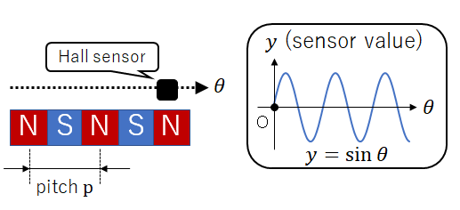
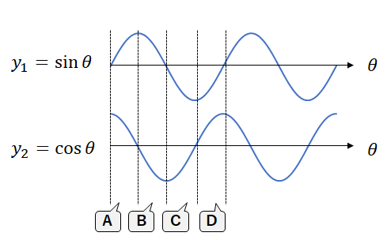

# Digital Caliper on STM32 "CurematicCaliper"

## Overview(概要)

This repository shows digital caliper application on STM32.

STM32を使用した自作デジタルノギスです。リニアエンコーダ部から自作しています。

## Features(特徴)

* 3D printed body (本体は3Dプリンタ製)
* 0.01mm resolution (分解能0.01mm)
* Self calibration (自己校正機能)
* Dual power supplies (二系統の電源に対応) :CR2016 or USB Type-C
* Data output function via USB (USB経由で測定値を出力可能)

## Principles(原理)

### Position detection(位置検出)

The position is calculated by sensing magnetic field of the sheet magnet with Hall sensors.

シート磁石の磁界をホールセンサで測定することで、位置を検出しています。

Sheet magnet have alternating N-S blocks. When a linear output Hall sensor moves on a sheet magnet, nearly sine wave is output.
Assuming: Let y be the sensor output value and θ be a position of the sensor. Then .

シート磁石は、N極とS極が交互に並んでおり、リニア出力のホールセンサを滑らせるとsin波に似た信号が出力されます。そこで、センサ出力をy、位置をθとして、に従うと仮定します。

Now, install the two sensors with their positions shifted so that the output as following.

いま、2個のセンサを、位置をズラして設置し、出力が次に従うようにします。

Then, the graph area can be divided into A to D regions as shown in upper figure depending on .

このとき、の値によって、図のように領域A,B,C,Dに分けることができます。

* A：
* B：
* C：
* D：

Next, consider how to detect the moving direction and calculate the rough position.
Let  be the number of passes through the A-D region. Add 1 to  if the region changes forward as A→B→C→D→A and subtract 1 from  if the region changes reverse as A→D→C→B→A. Where  is the magnet pitch (between N-N pole), the rough position  is as follows.

次に、方向検出し、大まかな位置を計算します。領域を周回する回数をとし、A→B→C→D→A と正転すればに1を加え、A→D→C→B→Aと逆転すればに1を減じます。1周期分の磁石ピッチ(N極とN極の間)をとすれば、大まかな位置は、次の通りです。

In addition, calculate the accrate position  from . Where 

さらに、から正確な位置を計算します。ただし、の範囲で考えます。

Therefore, position is as follows.

以上より、位置は次のように求まります。

### Position error compensation(位置ずれ補償)

Ideally, the sensors output values are , but the actual sensor output has error because of the position error  of sensors. Hence:

センサ出力がとなるのが理想ですが、実際のセンサ位置にはずれが存在するので、次のように書けます。

If we estimate  from  and calculate  from  , the accracy of  is improved. Please refer to [this tweet](https://twitter.com/keshinomi_88pro/status/1157645938023792640) (written in japanese)

からを推定しを求めると、の精度向上に寄与します。具体的な方法論は[ツイート](https://twitter.com/keshinomi_88pro/status/1157645938023792640)の通りです。

## Hardware

See [Schematic](./hardware/schematic/schematic.pdf), and [3Dmodel](./hardware/3dmodel/model.stp).

回路図は[こちら](./hardware/schematic/schematic.pdf)、3Dモデルは[こちら](./hardware/3dmodel/model.stp)。

## Software

Install [STM32CubeIDE](https://www.st.com/ja/development-tools/stm32cubeide.html), import [Project files](./software/cubeide_project/). If you have successfully imported, you can build the project without error and the binary file will be created in /cubeide_project/Debug/.

[STM32CubeIDE](https://www.st.com/ja/development-tools/stm32cubeide.html)をインストールし、[プロジェクトファイル](./software/cubeide_project/)をインポートして下さい。インポートに成功していれば、CubeIDE上でプロジェクトをビルドするだけで、/cubeide_project/Debug/フォルダにバイナリファイルが生成されるはずです。

## NOTICE(注意)

### VID/PID

Vendor ID(VID) and Product ID(PID) in <usbd_desc.c> should be unique pair for each USB devices.
Default VID 0x1209 and PID 0x0001 is experimental IDs from [http://pid.codes](http://pid.codes) .When distributing or selling, you must get your own IDs, and change to your own IDs in order to avoid conflicting to other USB devices.

USBのVendor ID(VID)とProduct ID(PID)は、<usbd_desc.c>内に記述します。
デフォルトのVID(0x1209)/PID(0x0001)ペアは、[http://pid.codes](http://pid.codes)で定められている実験用IDです。そのため、本機器を配布したり販売したりする場合には、別途固有のIDペアを取得し、書き換えてご使用いただく必要があります。

## References(参考文献)

* [自作リニアエンコーダ: Crescent](http://meerstern.seesaa.net/article/451201176.html)
* [TEFSOM氏のツイート](https://twitter.com/Si_SJ_MOSFET/status/1155133959648342016)

## Copyrights(著作権)

* STM32 CubeL4 by [STMicroelectronics](https://www.st.com/en/embedded-software/stm32cubel4.html)
* [μGUI - Open Source GUI module for embedded systems](https://github.com/achimdoebler/UGUI)

## Author

(c) 2019 Keshikan ( [Website](http://www.keshikan.net/),  [Twitter](https://twitter.com/keshinomi_88pro) )

## License

* STM32 CubeL4: BSD-3-Clause based.
* μGUI: [original license](https://github.com/achimdoebler/UGUI/blob/master/LICENSE.md)
* Other Codes, Hardware, Schematic: [GPLv3](https://www.gnu.org/licenses/gpl-3.0.html)

See also [LICENSE.md](./LICENSE.md)
